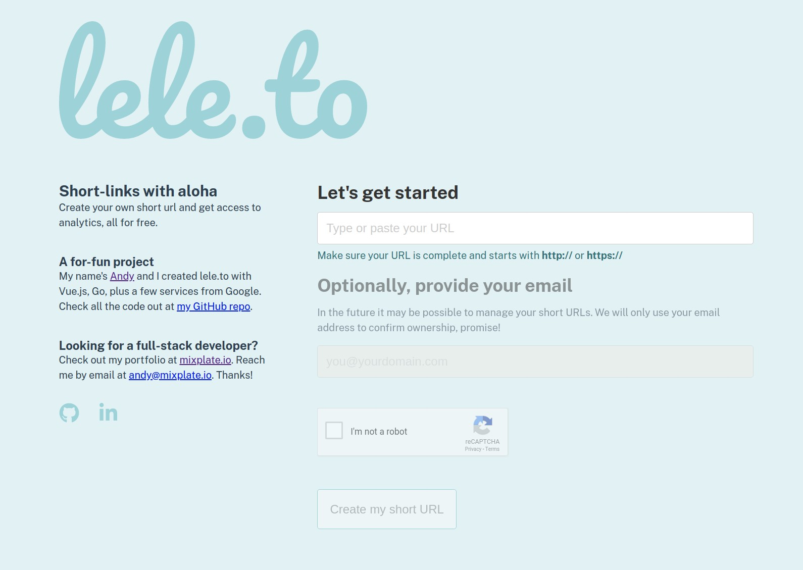

# lele.to - short links with aloha

## Work In Progress
Currently I'm focusing on the desktop web app, using Vue.js. A responsive mobile view will come later. The "wizard" for creating short URLs (screenshot below) is nearly completed, it's the Analytics Dashboard that will require the most love.

## Compute Engine
---
I'm working on the server, too, using Go. It will be deployed on a Compute Engine by Google. Right now it uses BadgerDB to store basic information about each short URL, but all analytics for click throughs are provided to Google Analytics. There is a limit to API calls but since this is a toy app it won't be a problem (or at least it'd be a good problem to have).

---

